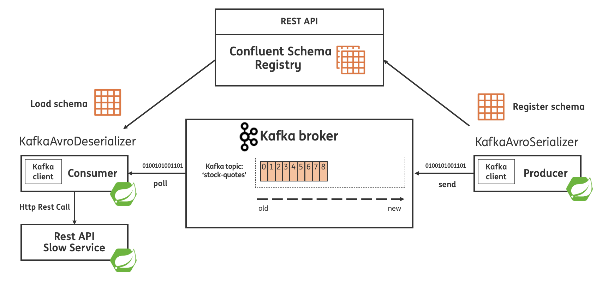
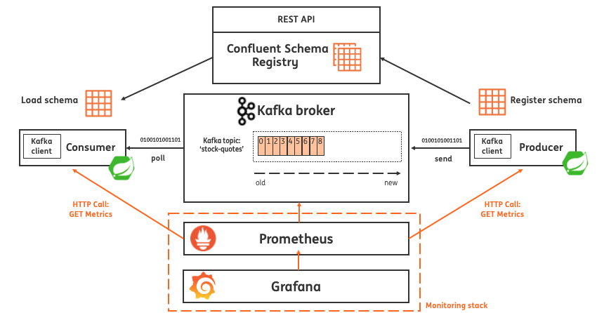
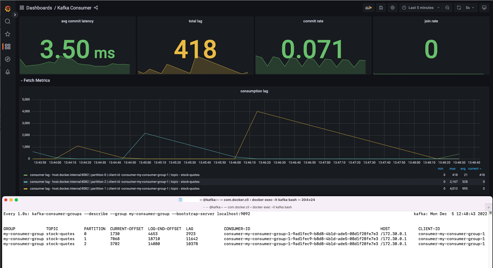
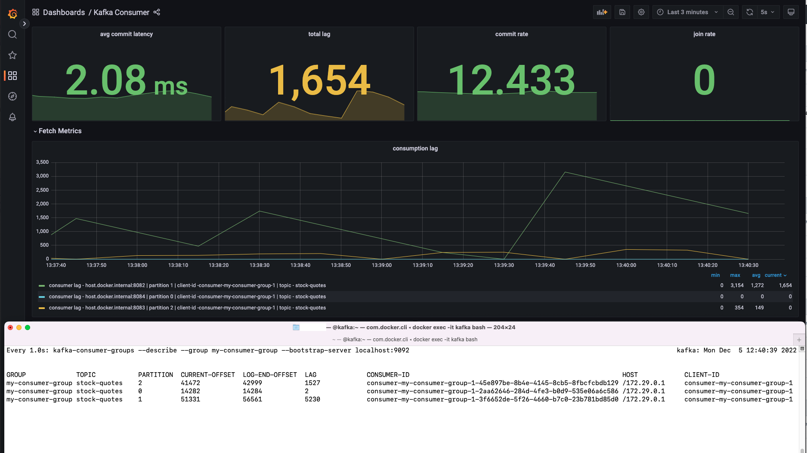

# Kafka client side metrics playground

Goal of this project: understand the client side Kafka metrics for both consumer and producers.
With the focus on client side consumer lag metrics and understand how they should be interpreted compared to the consumer lag numbers available on the Kafka broker(s). 

This small project can be used to reproduce the difference in consumer lag numbers.

Context for the example:

* Teams using Kafka should be able to monitor their own applications using client side Kafka metrics
* Without having access to Kafka broker metrics, because the Kafka cluster is owned by a platform team and the team using Kafka doesn't have access to the broker metrics.

## Questions to answer

* Why are the consumer lag metrics number so far off compared with the consumer lag numbers available from the broker?
* Are the client side metrics (especially the client side consumer lag metrics) reliable enough be used in dashboards and eventually to alert on?
* Do we interpret the consumer lag metrics in a wrong way?

## Consumer lag metrics

From the [Confluent - Monitor Consumer Lag](https://docs.confluent.io/platform/current/kafka/monitoring.html#consumer-metrics) documentation.

### Partition-level Fetch Metrics

* `records-lag`
  * Description: The latest lag of the partition.
  * In prometheus: `kafka_consumer_fetch_manager_records_lag`
  * Type: `gauge`
  * See: [`kafka_consumer_fetch_manager_records_lag`](http://localhost:9090/graph?g0.expr=kafka_consumer_fetch_manager_records_lag&g0.tab=1&g0.stacked=0&g0.show_exemplars=0&g0.range_input=1h) metric in Prometheus
* `records-lag-avg`
  * Description: The average lag of the partition.
  * In prometheus: `kafka_consumer_fetch_manager_records_lag_avg`
  * Type: `gauge`
  * See: [`kafka_consumer_fetch_manager_records_lag_avg`](http://localhost:9090/graph?g0.expr=kafka_consumer_fetch_manager_records_lag_avg&g0.tab=1&g0.stacked=0&g0.show_exemplars=0&g0.range_input=1h) metric in Prometheus
* `records-lag-max`
  * Description: The max lag of the partition.
  * In prometheus: `kafka_consumer_fetch_manager_records_lag_max`
  * Type: `gauge`
  * See: [`kafka_consumer_fetch_manager_records_lag_max`](http://localhost:9090/graph?g0.expr=kafka_consumer_fetch_manager_records_lag_max&g0.tab=1&g0.stacked=0&g0.show_exemplars=0&g0.range_input=1h) metric in Prometheus

### Fetch Metrics

* `records-lag-max`
  * Description: `The maximum lag in terms of number of records for any partition in this window. An increasing value over time is your best indication that the consumer group is not keeping up with the producers.`
  * Type: `gauge`


## Project modules and applications

| Applications          | Port | Avro  | Topic(s)      | Description                                                                                                                                |
|-----------------------|------|-------|---------------|--------------------------------------------------------------------------------------------------------------------------------------------|
| spring-kafka-producer | 8080 | YES   | stock-quotes  | Simple producer of random stock quotes using Spring Kafka & Apache Avro.                                                                   |
| spring-kafka-consumer | 8082 | YES   | stock-quotes  | Simple consumer of stock quotes using using Spring Kafka & Apache Avro. This application will call the slow REST API, building up consumer lag |
| slow-downstream-service | 7999 | NO   |   | Simple application exposing a slow performing REST API.  |

| Module     | Description                                                                                                                |
|------------|----------------------------------------------------------------------------------------------------------------------------|
| avro-model | Holds the Avro schema for the Stock Quote including `avro-maven-plugin` to generate Java code based on the Avro Schema. This module is used by both the producer, consumer and Kafka streams application. |

Note Confluent Schema Registry is running on port: `8081` using Docker see: [docker-compose.yml](docker-compose.yml).



Including monitoring:



## Topic details

* Topic name: `stock-quotes`
* Number of partitions: 3

For more information see the: [Topic Details](http://localhost:9000/ui/clusters/local/topics/stock-quotes/settings)

## Version

* Confluent Kafka: 7.2.x
* Confluent Schema Registry: 7.2.x
* Java: 11
* Spring Boot: 2.7.x
* Spring for Apache Kafka: 2.8.x
* Apache Avro: 1.11
* Prometheus: v2.40.x
* Grafana: 9.2.x

## Components running in Docker

* Kafka (port 9092)
* Zookeeper (port 2181)
* [Schema Registry](http://localhost:8081)
* [Kafka UI](http://localhost:9000)
* [Prometheus](http://localhost:9090)
  * See scraped [targets](http://localhost:9090/targets)
* [Grafana](http://localhost:3000/)
  * [Dashboard](http://localhost:3000/dashboards) 
  * [Consumer dashboard](http://localhost:3000/d/CLUjsRFZz/kafka-consumer) (based on Kafka client side metrics)

## Build the project

```bash
./mvnw clean install
```

## Run 

### Step1: Run the infrastructure (Kafka, Zookeeper, Prometheus, Grafana and Kafka UI)

```bash
docker-compose up -d
```

### Step 2: Run the producer application

```bash
./mvnw spring-boot:run -pl spring-kafka-producer
```

Once started this application start producing a Stock Quote every 10ms to produce load on the topic [stock-quotes](http://localhost:9000/ui/clusters/local/topics/stock-quotes)

The producer application will expose Kafka client metrics via Micrometer ready for Prometheus to scrape.
* [Producer - Kafka client side metrics Prometheus ](http://localhost:8080/actuator/prometheus)

### Step 3: Run the slow downstream service

This application will simulate a slow API that will be called by the `spring-kafka-consumer` application to intentionally build up consumer lag!

See: [RestApi.java](slow-downstream-service/src/main/java/nl/jtim/spring/kafka/slow/service/RestApi.java)

```bash
./mvnw spring-boot:run -pl slow-downstream-service
```

### Step 4: Run consumer application

Now start the consumer application (open a new terminal)

```bash
./mvnw spring-boot:run -pl spring-kafka-consumer
```

The consumer application will expose Kafka client metrics via Micrometer ready for Prometheus to scrape.
* [Consumer - Kafka client side metrics Prometheus ](http://localhost:8082/actuator/prometheus)

### Step 5: Build up consumer lag

The producer is producing more data to Kafka the consumer can handle.
The result is the consumer is building up some consumer lag

We are in particular interested in the following metrics:
* `kafka_consumer_fetch_manager_records_lag`
  * [See kafka_consumer_fetch_manager_records_lag metric in Prometheus](http://localhost:9090/graph?g0.expr=kafka_consumer_fetch_manager_records_lag&g0.tab=1&g0.stacked=0&g0.show_exemplars=0&g0.range_input=1h)
* `kafka_consumer_fetch_manager_records_lag_avg`
  * [See kafka_consumer_fetch_manager_records_lag_avg metric in Prometheus](http://localhost:9090/graph?g0.expr=kafka_consumer_fetch_manager_records_lag_avg&g0.tab=1&g0.stacked=0&g0.show_exemplars=0&g0.range_input=1h)
* `kafka_consumer_fetch_manager_records_lag_max`
  * [See kafka_consumer_fetch_manager_records_lag_max metric in Prometheus](http://localhost:9090/graph?g0.expr=kafka_consumer_fetch_manager_records_lag_max&g0.tab=1&g0.stacked=0&g0.show_exemplars=0&g0.range_input=1h)

[Show all lag metrics](http://localhost:9090/graph?g0.expr=kafka_consumer_fetch_manager_records_lag&g0.tab=1&g0.stacked=0&g0.show_exemplars=0&g0.range_input=1h&g1.expr=sum(kafka_consumer_fetch_manager_records_lag%7Bconsumer_group%3D%22my-consumer-group%22%2C%20topic%3D%22stock-quotes%22%7D)&g1.tab=1&g1.stacked=0&g1.show_exemplars=0&g1.range_input=1h&g2.expr=kafka_consumer_fetch_manager_records_lag_avg&g2.tab=1&g2.stacked=0&g2.show_exemplars=0&g2.range_input=1h&g3.expr=sum(kafka_consumer_fetch_manager_records_lag_avg%7Bconsumer_group%3D%22my-consumer-group%22%2C%20topic%3D%22stock-quotes%22%7D)&g3.tab=1&g3.stacked=0&g3.show_exemplars=0&g3.range_input=1h&g4.expr=kafka_consumer_fetch_manager_records_lag_max&g4.tab=1&g4.stacked=0&g4.show_exemplars=0&g4.range_input=1h&g5.expr=sum(kafka_consumer_fetch_manager_records_lag_max%7Bconsumer_group%3D%22my-consumer-group%22%2C%20topic%3D%22stock-quotes%22%7D)&g5.tab=1&g5.stacked=0&g5.show_exemplars=0&g5.range_input=1h)

Compare with the lag on the broker:

Attach to the Kafka broker running in Docker:

```bash
docker exec -it kafka bash
```

Unset the JXM Port

```bash
unset JMX_PORT
```

See the consumer lag:

```bash
watch --interval 1 kafka-consumer-groups --describe --group my-consumer-group --bootstrap-server localhost:9092
```

We see the client side metrics are far off compared to the lag number available on the broker:




## Run multiple consumer instances

Run another two more consumer instances:

```bash
./mvnw spring-boot:run -pl spring-kafka-consumer -Dspring-boot.run.arguments=--server.port=8083
```

```bash
./mvnw spring-boot:run -pl spring-kafka-consumer -Dspring-boot.run.arguments=--server.port=8084
```

Also here we see the client side metrics are far off compared to the lag number available on the broker:



## Shutdown 

To shut down everything run:  

```
docker-compose down -v
```

Press `ctrl` + `c` to stop the Spring Boot application(s).

## Consumer configuration details

### ConsumerConfig

```
2022-12-05 13:28:31.489  INFO 49072 --- [           main] o.a.k.clients.consumer.ConsumerConfig    : ConsumerConfig values:
allow.auto.create.topics = true
auto.commit.interval.ms = 5000
auto.offset.reset = earliest
bootstrap.servers = [localhost:9092]
check.crcs = true
client.dns.lookup = use_all_dns_ips
client.id = consumer-my-consumer-group-1
client.rack =
connections.max.idle.ms = 540000
default.api.timeout.ms = 60000
enable.auto.commit = false
exclude.internal.topics = true
fetch.max.bytes = 52428800
fetch.max.wait.ms = 500
fetch.min.bytes = 1
group.id = my-consumer-group
group.instance.id = null
heartbeat.interval.ms = 3000
interceptor.classes = []
internal.leave.group.on.close = true
internal.throw.on.fetch.stable.offset.unsupported = false
isolation.level = read_uncommitted
key.deserializer = class org.apache.kafka.common.serialization.StringDeserializer
max.partition.fetch.bytes = 1048576
max.poll.interval.ms = 300000
max.poll.records = 500
metadata.max.age.ms = 300000
metric.reporters = []
metrics.num.samples = 2
metrics.recording.level = INFO
metrics.sample.window.ms = 30000
partition.assignment.strategy = [class org.apache.kafka.clients.consumer.RangeAssignor, class org.apache.kafka.clients.consumer.CooperativeStickyAssignor]
receive.buffer.bytes = 65536
reconnect.backoff.max.ms = 1000
reconnect.backoff.ms = 50
request.timeout.ms = 30000
retry.backoff.ms = 100
sasl.client.callback.handler.class = null
sasl.jaas.config = null
sasl.kerberos.kinit.cmd = /usr/bin/kinit
sasl.kerberos.min.time.before.relogin = 60000
sasl.kerberos.service.name = null
sasl.kerberos.ticket.renew.jitter = 0.05
sasl.kerberos.ticket.renew.window.factor = 0.8
sasl.login.callback.handler.class = null
sasl.login.class = null
sasl.login.connect.timeout.ms = null
sasl.login.read.timeout.ms = null
sasl.login.refresh.buffer.seconds = 300
sasl.login.refresh.min.period.seconds = 60
sasl.login.refresh.window.factor = 0.8
sasl.login.refresh.window.jitter = 0.05
sasl.login.retry.backoff.max.ms = 10000
sasl.login.retry.backoff.ms = 100
sasl.mechanism = GSSAPI
sasl.oauthbearer.clock.skew.seconds = 30
sasl.oauthbearer.expected.audience = null
sasl.oauthbearer.expected.issuer = null
sasl.oauthbearer.jwks.endpoint.refresh.ms = 3600000
sasl.oauthbearer.jwks.endpoint.retry.backoff.max.ms = 10000
sasl.oauthbearer.jwks.endpoint.retry.backoff.ms = 100
sasl.oauthbearer.jwks.endpoint.url = null
sasl.oauthbearer.scope.claim.name = scope
sasl.oauthbearer.sub.claim.name = sub
sasl.oauthbearer.token.endpoint.url = null
security.protocol = PLAINTEXT
security.providers = null
send.buffer.bytes = 131072
session.timeout.ms = 45000
socket.connection.setup.timeout.max.ms = 30000
socket.connection.setup.timeout.ms = 10000
ssl.cipher.suites = null
ssl.enabled.protocols = [TLSv1.2, TLSv1.3]
ssl.endpoint.identification.algorithm = https
ssl.engine.factory.class = null
ssl.key.password = null
ssl.keymanager.algorithm = SunX509
ssl.keystore.certificate.chain = null
ssl.keystore.key = null
ssl.keystore.location = null
ssl.keystore.password = null
ssl.keystore.type = JKS
ssl.protocol = TLSv1.3
ssl.provider = null
ssl.secure.random.implementation = null
ssl.trustmanager.algorithm = PKIX
ssl.truststore.certificates = null
ssl.truststore.location = null
ssl.truststore.password = null
ssl.truststore.type = JKS
value.deserializer = class io.confluent.kafka.serializers.KafkaAvroDeserializer
```

### KafkaAvroDeserializerConfig

```
2022-12-05 13:28:31.530  INFO 49072 --- [           main] i.c.k.s.KafkaAvroDeserializerConfig      : KafkaAvroDeserializerConfig values:
auto.register.schemas = true
avro.reflection.allow.null = false
avro.use.logical.type.converters = false
basic.auth.credentials.source = URL
basic.auth.user.info = [hidden]
bearer.auth.credentials.source = STATIC_TOKEN
bearer.auth.token = [hidden]
context.name.strategy = class io.confluent.kafka.serializers.context.NullContextNameStrategy
id.compatibility.strict = true
key.subject.name.strategy = class io.confluent.kafka.serializers.subject.TopicNameStrategy
latest.compatibility.strict = true
max.schemas.per.subject = 1000
normalize.schemas = false
proxy.host =
proxy.port = -1
schema.reflection = false
schema.registry.basic.auth.user.info = [hidden]
schema.registry.ssl.cipher.suites = null
schema.registry.ssl.enabled.protocols = [TLSv1.2, TLSv1.3]
schema.registry.ssl.endpoint.identification.algorithm = https
schema.registry.ssl.engine.factory.class = null
schema.registry.ssl.key.password = null
schema.registry.ssl.keymanager.algorithm = SunX509
schema.registry.ssl.keystore.certificate.chain = null
schema.registry.ssl.keystore.key = null
schema.registry.ssl.keystore.location = null
schema.registry.ssl.keystore.password = null
schema.registry.ssl.keystore.type = JKS
schema.registry.ssl.protocol = TLSv1.3
schema.registry.ssl.provider = null
schema.registry.ssl.secure.random.implementation = null
schema.registry.ssl.trustmanager.algorithm = PKIX
schema.registry.ssl.truststore.certificates = null
schema.registry.ssl.truststore.location = null
schema.registry.ssl.truststore.password = null
schema.registry.ssl.truststore.type = JKS
schema.registry.url = [http://localhost:8081]
specific.avro.reader = true
use.latest.version = false
use.schema.id = -1
value.subject.name.strategy = class io.confluent.kafka.serializers.subject.TopicNameStrategy
```
